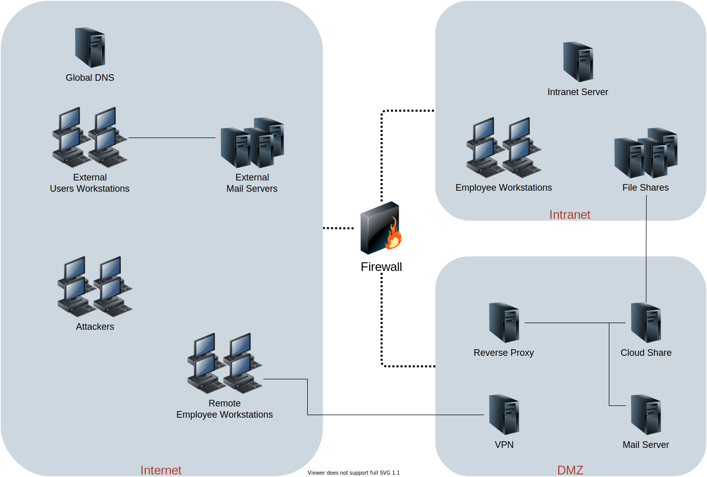

# Testbed - Hosts

This repository contains a terraform module defining the hosts for the AECID testbed. 

## Network Overview

<center>

<div><em>Testbed Hosts Network Overview</em></div>
</center>

## Example Usage

```terragrunt
terraform {
    source = ".//hosts"
}

inputs = {
    internet = "testnet"
    internet_subnet = "testsubnet"
    dmz = "dmz"
    dmz_subnet = "dmz-subnet"
    intranet = "local"
    intranet_subnet = "local-subnet"

    # image configuration
    image = "cr-ubuntu-bionic-amd64"
    employee_image = "cr-client-ubuntu-2020-04-14_10-30-22"
    share_image = "cr-samba-4.5.9-2019-11-15_12-25-25"

    employee_capacity        = 1
    remote_employee_capacity = 1
    attacker_capacity = 1
    
    shares = [
        {
            name     = "internal"
            ip_index = null
        }
    ]
}

include {
  path = find_in_parent_folders()
}
```